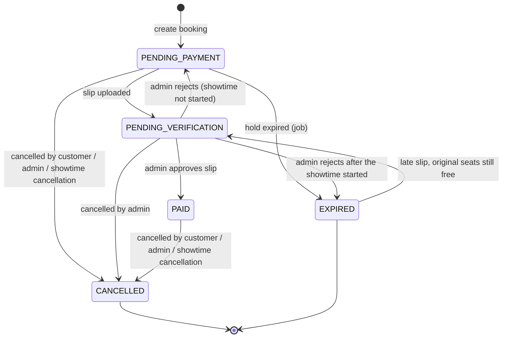
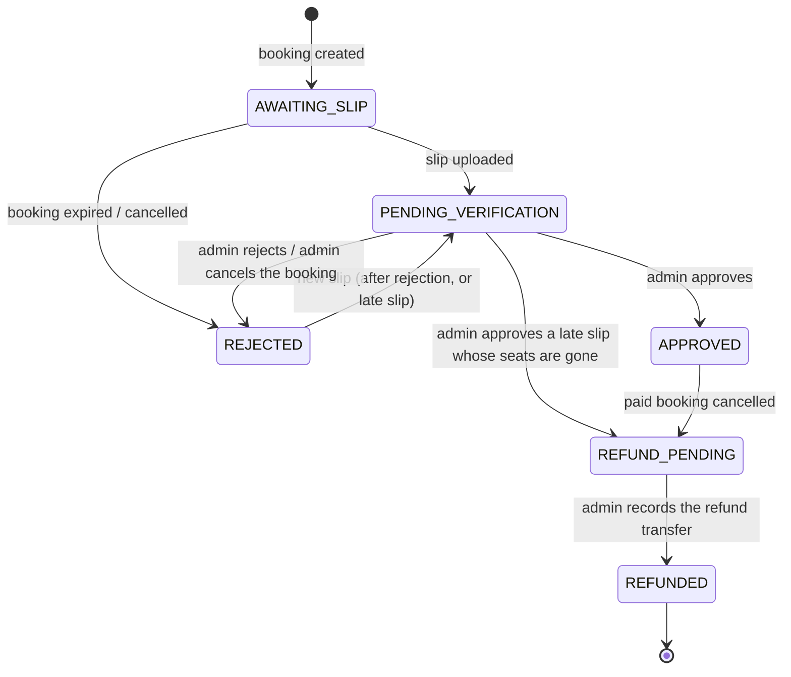
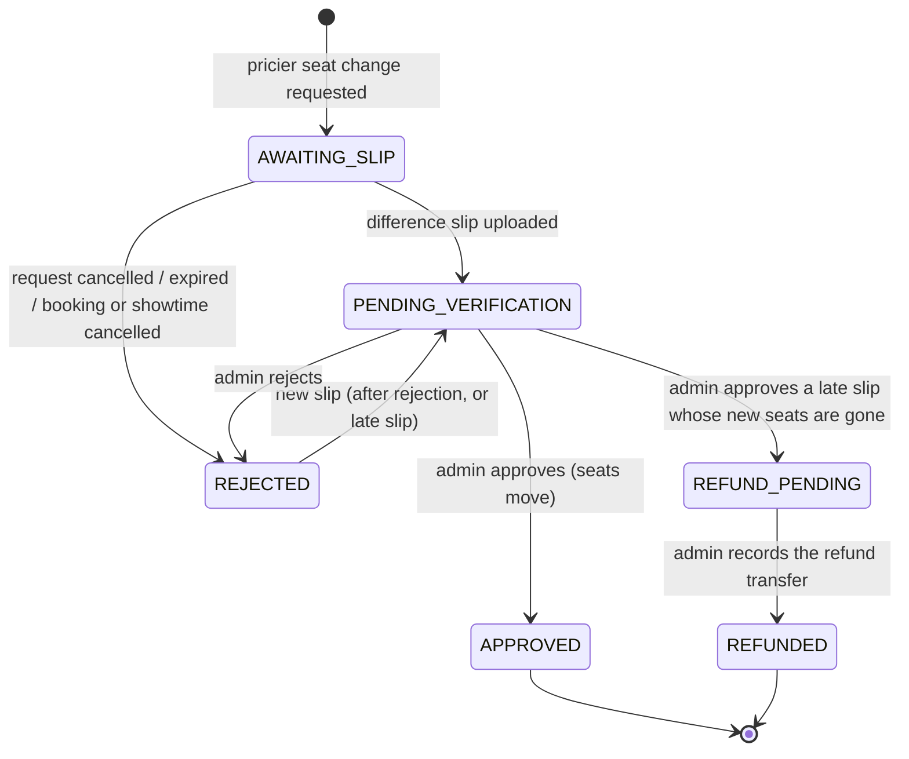
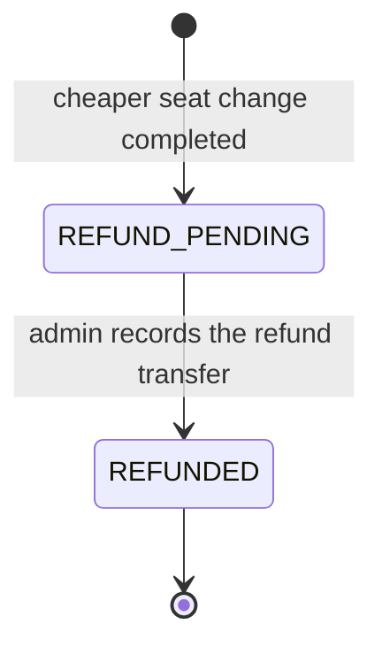
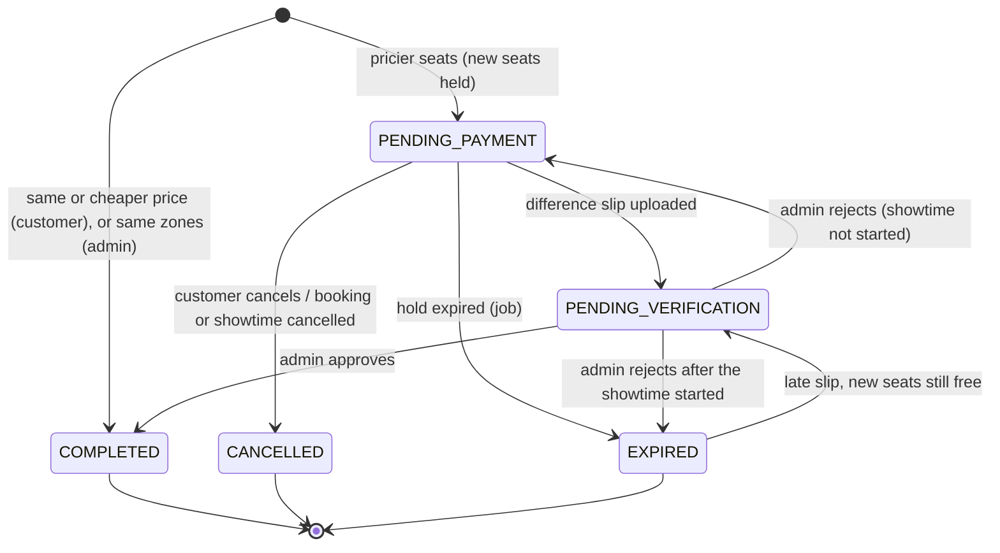
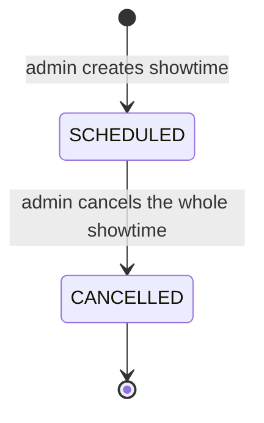

# State machines

Every status change below is a compare-and-set update in `server/src/services/` (the expected status is part of the `WHERE`), so two actions racing for the same row can't both win — see [Concurrent status changes](architecture.md#concurrent-status-changes).
Durations come from [configuration](configuration.md): `SEAT_HOLD_MINUTES` (10), `REJECTED_RETRY_MINUTES` (10), `LATE_SLIP_GRACE_MINUTES` (30), `CANCEL_CUTOFF_HOURS` (3), `SEAT_CHANGE_CUTOFF_MINUTES` (30)

- [Booking](#booking)
- [Payment](#payment) — one model, three kinds: `BOOKING`, `SEAT_CHANGE_TOPUP`, `SEAT_CHANGE_REFUND`
- [Seat change](#seat-change)
- [Showtime](#showtime)

---

## Booking

`Booking.status` — the seats a booking holds are its `BookingSeat` rows; closing a booking (cancel or expiry) deletes them

| From → to | Trigger | Notes |
|---|---|---|
| — → `PENDING_PAYMENT` | `POST /api/bookings` | Seats held for `SEAT_HOLD_MINUTES` (`holdExpiresAt`); a main `Payment` (`AWAITING_SLIP`) is created in the same transaction |
| `PENDING_PAYMENT` → `PENDING_VERIFICATION` | `POST /api/payments/:bookingId/slip` | `holdExpiresAt = null` stops the countdown; seats stay held until the admin decides. Accepted even past the deadline if the job hasn't released the seats yet |
| `PENDING_PAYMENT` → `EXPIRED` | Job, every 30 s | Seats released, payment `AWAITING_SLIP` → `REJECTED`, `expiredAt` set (starts the late-slip grace period), `BOOKING_EXPIRED` notification |
| `PENDING_PAYMENT` → `CANCELLED` | `POST /api/bookings/:id/cancel`, `POST /api/admin/bookings/:id/cancel`, `POST /api/admin/showtimes/:id/cancel` | Seats released, open payment closed as `REJECTED` |
| `PENDING_VERIFICATION` → `PAID` | `POST /api/admin/payments/:id/approve` | Receipt number issued in the same transaction; receipt emailed after commit |
| `PENDING_VERIFICATION` → `PENDING_PAYMENT` | `POST /api/admin/payments/:id/reject` | New hold of `REJECTED_RETRY_MINUTES` |
| `PENDING_VERIFICATION` → `EXPIRED` | `POST /api/admin/payments/:id/reject` after the showtime started | Seats released; a valid slip can still be sent within the grace period to get the money back |
| `PENDING_VERIFICATION` → `CANCELLED` | `POST /api/admin/bookings/:id/cancel` | Customers can't cancel here (409 `AWAITING_VERIFICATION`), and a showtime with pending slips can't be cancelled (409 `SHOWTIME_HAS_PENDING_SLIPS`) |
| `EXPIRED` → `PENDING_VERIFICATION` | `POST /api/payments/:bookingId/slip` within `LATE_SLIP_GRACE_MINUTES` of `expiredAt` | Only if the original seats are free, still active and the showtime is still open; otherwise the booking stays `EXPIRED` and only the payment moves (see below) |
| `PAID` → `CANCELLED` | Customer (≥ `CANCEL_CUTOFF_HOURS` before the showtime, refund account required), admin (any time) or showtime cancellation | Main payment `APPROVED` → `REFUND_PENDING` with `refundAmount` = the booking's net total. Blocked while a seat-change difference slip awaits review (409 `SEAT_CHANGE_AWAITING_VERIFICATION`) |

`PAID` bookings keep their status through seat changes; `seatSnapshot` and `totalAmount` are updated instead

---

## Payment

`Payment.status`, by `Payment.kind`. The kind and its columns are kept consistent by a CHECK constraint; `booking.payment` is the `BOOKING` payment (via `mainBookingId`)

### Ticket payment — `kind = BOOKING`

| From → to | Trigger | Notes |
|---|---|---|
| `AWAITING_SLIP` / `REJECTED` → `PENDING_VERIFICATION` | Slip upload (on time, after a rejection, or late) | The previous slip file is deleted after the new one is saved |
| `PENDING_VERIFICATION` → `APPROVED` | Approve | `receiptNo`, `receiptName` and `receiptSeats` are frozen on the payment |
| `PENDING_VERIFICATION` → `REFUND_PENDING` | Approve a late slip while the booking is still `EXPIRED` | Money arrived but there are no seats: refund the full amount, no receipt, `LATE_PAYMENT_REFUND` notification |
| `APPROVED` → `REFUND_PENDING` | Booking cancelled after payment | `refundAmount` = `Booking.totalAmount` (net of seat-change differences); refund account from the cancel request, or added later via `PATCH /api/bookings/:id/refund-account` |
| `REFUND_PENDING` → `REFUNDED` | `POST /api/admin/refunds/:id/complete` (refund slip required) | `REFUND_COMPLETED` notification. `PATCH /api/admin/refunds/:id` can replace the slip or note later without changing the status |

### Seat-change difference to pay — `kind = SEAT_CHANGE_TOPUP`

Approving issues a separate difference receipt (`GET /api/bookings/:id/receipt?payment=<id>`). An approved difference is never refunded on its own: if the booking is cancelled later, it is included in the main payment's net `refundAmount`

### Seat-change difference to refund — `kind = SEAT_CHANGE_REFUND`

Created together with the completed seat change, with the refund account the customer entered

---

## Seat change

`SeatChange.status` — one open request (`PENDING_PAYMENT` or `PENDING_VERIFICATION`) per booking at a time. The customer's current seats are never touched until the change completes; the new seats are held as `BookingSeat` rows carrying the `seatChangeId`

| From → to | Trigger | Notes |
|---|---|---|
| — → `COMPLETED` | `POST /api/bookings/:id/seat-changes` (difference ≤ 0) or `POST /api/admin/bookings/:id/change-seats` | Seats moved in one transaction; a negative difference creates a `SEAT_CHANGE_REFUND` payment. Admin moves must keep every seat's zone (400 `SEAT_ZONE_MISMATCH`) and don't count toward the customer's quota |
| — → `PENDING_PAYMENT` | `POST /api/bookings/:id/seat-changes` (difference > 0) | New seats held for `SEAT_HOLD_MINUTES`; a `SEAT_CHANGE_TOPUP` payment is created |
| `PENDING_PAYMENT` → `PENDING_VERIFICATION` | `POST /api/seat-changes/:id/slip` | Same slip-submission code as ticket payments |
| `PENDING_PAYMENT` → `EXPIRED` | Job, every 30 s | Held new seats released, top-up `AWAITING_SLIP` → `REJECTED`, `SEAT_CHANGE_EXPIRED` notification |
| `PENDING_PAYMENT` → `CANCELLED` | `POST /api/seat-changes/:id/cancel`, booking cancellation, showtime cancellation | Not allowed once the slip is uploaded (409 `SEAT_CHANGE_AWAITING_VERIFICATION`) |
| `PENDING_VERIFICATION` → `COMPLETED` | `POST /api/admin/payments/:id/approve` | Booking's `seatSnapshot` / `totalAmount` updated, held seats become the booking's seats, difference receipt issued |
| `PENDING_VERIFICATION` → `PENDING_PAYMENT` | `POST /api/admin/payments/:id/reject` | New hold of `REJECTED_RETRY_MINUTES`; the new seats stay held |
| `PENDING_VERIFICATION` → `EXPIRED` | Reject after the showtime started | Held new seats released |
| `EXPIRED` → `PENDING_VERIFICATION` | Late difference slip within `LATE_SLIP_GRACE_MINUTES` | Only if the new seats are free, the booking still has the same seats and no other open request; otherwise the request stays `EXPIRED` and approving the slip refunds the difference |

Quota: at most `MAX_SEAT_CHANGES_PER_BOOKING` customer requests per booking count — `PENDING_PAYMENT`, `PENDING_VERIFICATION` and `COMPLETED` requests made by the customer; expired, cancelled and admin moves don't count

---

## Showtime

`POST /api/admin/showtimes/:id/cancel` closes every `PENDING_PAYMENT` / `PAID` booking and open seat-change request in one transaction, queues refunds for paid bookings and notifies every customer. It is refused while any slip of that showtime awaits review (409 `SHOWTIME_HAS_PENDING_SLIPS`) and after the showtime has ended (409 `SHOWTIME_ENDED`). `PATCH /api/admin/showtimes/:id` can't change the status
